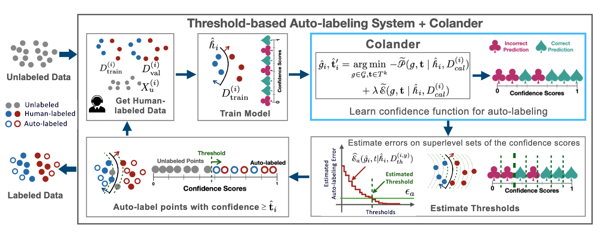

# Pearls from Pebbles: Improved Confidence Functions for Auto-labeling 



**Summary:** This work examines the development of optimal confidence functions within the threshold-based auto-labeling (TBAL) framework, enhancing better coverage and accuracy in labeling workflows.

> **Keywords:** Auto Labeling, Confidence Functions, Active Learning, Selective Classification

# Getting Started 
First things first, lets create the conda environment as follows,

## Environment Setup

1. **Create the Conda environment:**

```
conda env create -f environment.yml
```

2. **Activate the environment:**

```
conda activate tbal
```

Now lets run some examples,

### Running the Code

The code supports two main modes:

#### 1. **Basic Run Mode**

   This mode allows a straightforward execution with a predefined configuration file. This is ideal for initial exploration without hyperparameter tuning. To start:

   1. Navigate to the `scripts` directory:
      ```bash
      cd ./scripts
      ```
   2. Run the MNIST LeNet example:
      ```bash
      ./run_mnist_tbal_eval_full_fixed.sh
      ```
   This script uses a fixed configuration designed for general testing purposes. You can find configuration files for different models and datasets in `./configs/calib-exp`. For a detailed explanation of our hyperparameter tuning for TBAL, please refer to our paper published at [NeurIPS, 2024](https://arxiv.org/pdf/2404.16188).

#### 2. **Hyperparameter Search Mode**

   This search mode reproduces the hyperparameter search used in our experiments. For those who want to perform a full hyperparameter search similar to what was done in the paper, configuration files for various models and settings can be found under `configs/calib-exp/hyp-search/tbal`.

   - **TBAL Configurations**: `configs/calib-exp/hyp-search/tbal/mnist_lenet/mnist_lenet_common_fixed.json`
   - **Train-time Configurations**: `mnist_lenet/mnist_lenet_train_fixed.json`
   - **Post-hoc Configurations**: `mnist_lenet/mnist_lenet_post_fixed_std_xent.json`

### Additional Resources

Similarly, you'll find scripts for running CIFAR-10-CNN, TinyImageNet-MLP, and 20 Newsgroups-MLP conveniently located in the same directory.

---

## Compute Resources

Our experiments utilized the following GPUs:
- NVIDIA RTX A6000
- NVIDIA GeForce RTX 4090

--- 

## Citation

If you find this work useful, please consider citing our paper:

```bibtex
@article{author2024tbal,
  title={Pearls from Pebbles: Improved Confidence Functions for Auto-labeling},
  author={Harit Vishwakarma, Reid (Yi) Chen, Sui Jiet Tay, Satya Sai Srinath Namburi, Frederic Sala, Ramya Korlakai Vinayak},
  journal={NeurIPS},
  year={2024},
  url={https://arxiv.org/pdf/2404.16188}
}
